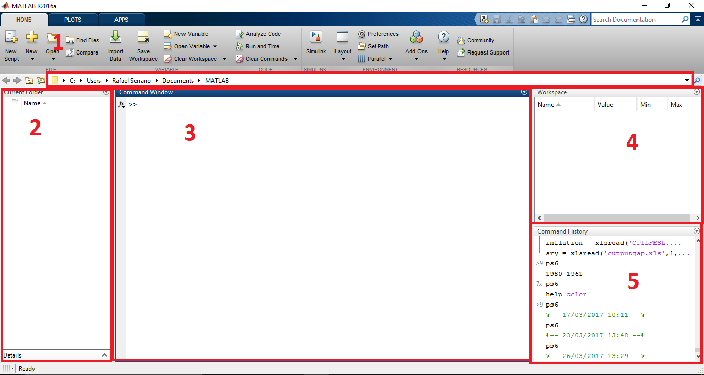

## First Time Opening Matlab



1. **Working directory**
2. **Files in working directory**
3. **Command prompt**
4. **Workspace**
5. **Command history**

## Comments

```matlab
% This is a comment
%{
  This is a block of comments. Everything between the two symbols is not processed by Matlab. Useful to define headers or helps for user-defined functions.
%}
```

## Creating Variables

```matlab
% Assign value 5 to "symbol" x
x = 5
```

- What happens if you type now in the command prompt `x`?

## Basic matrix operations

- Create a vector with 9 elements and add 2 to each of them

```matlab
x = [1 2 3 4 6 4 3 4 5]
y = x + 2
```

- Create a matrix with 9 elements from 1 to 9 in a single line

```matlab
>> A = reshape(1:9, 3, 3)'

A =

     1     2     3
     4     5     6
     7     8     9
```

- Solving a system of equations in with matrix inversion.

$$
\begin{cases}
2x + 3y - 4z = 3 \\
x - 8y + 2z = 12 \\
-3x + 5y - z = 0 \\
\end{cases}
$$

```matlab
A = [2 3 -4; 1 -8 2; -3 5 -1];
b = [3; 12; 0];

x = A\b

x =
   -3.6842
   -3.2105
   -5.0000
```

## Basic Logical Operations

- Find positive elements of a random matrix $A$ of size $20$.
- Find positive elements of a random matrix $A$ of size $n$.

